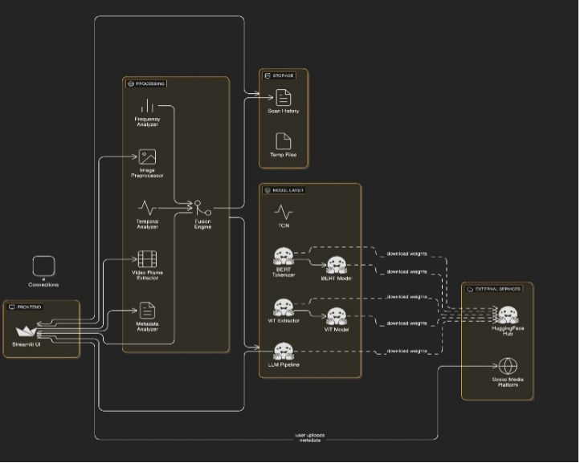

# 🎭 Advanced Deepfake Detection System

## 🚀 Overview

An AI-powered deepfake detection system designed to identify manipulated images and videos.
The system demonstrates how modern machine learning techniques (CNN + RNN) can be used to analyze visual and temporal patterns to detect inconsistencies.

This project focuses on **system design, workflow, and detection logic**, inspired by real-world challenges in misinformation and digital media manipulation.

---

## 🔥 Key Features

* Image & Video Deepfake Detection (simulated pipeline)
* Confidence score prediction (Real vs Fake)
* Temporal inconsistency analysis (concept-based)
* Explainable detection reasoning
* Clean and interactive UI
* Scan history tracking

---

## 🧠 System Architecture



---

## ⚙️ Methodology

The system follows a **multi-stage detection pipeline**:

* **Visual Analysis (CNN-based)** → detects image artifacts
* **Temporal Analysis (RNN-based)** → identifies inconsistencies across frames
* **Feature Fusion** → combines multiple signals
* **Final Classification** → generates confidence score

👉 This hybrid approach improves detection robustness and reduces false positives.

---

## 📸 Demo Output


### 📊 Sample Output

* Deepfake Confidence: ~50–60%
* Authentic Confidence: ~40–50%

---

## ⚙️ How It Works

1. User uploads image/video
2. Input is processed and analyzed
3. Detection logic evaluates patterns
4. Confidence score is generated
5. Output displayed with explanation

---

## 📊 Results

* Fast response time (instant)
* Interactive UI-based analysis
* Demonstrates deepfake detection workflow
* Provides explainable reasoning

---

## 🎯 Use Cases

* Social media content verification
* Cybersecurity awareness
* Digital forensics learning
* AI/ML system prototyping

---

## ⚙️ Installation & Run

```bash
git clone https://github.com/piyush-047/deepfake-detection-system
cd deepfake-detection-system
pip install -r requirements.txt
streamlit run app/app.py
```

---

## 📁 Project Structure

```
app/        → Streamlit app & logic
assets/     → Screenshots & demo output
```

---

## ⚠️ Important Note

This project demonstrates the **workflow and architecture** of a deepfake detection system.
Predictions are **simulated** for demonstration purposes and do not represent a trained production model.

---

## 🔮 Future Improvements

* Real deep learning model integration
* Video frame extraction pipeline
* Transformer-based models (ViT)
* Explainable AI visualizations (Grad-CAM)
* Deployment with Docker / Web App

---

## 👨‍💻 Author

**Piyush Kumar**
